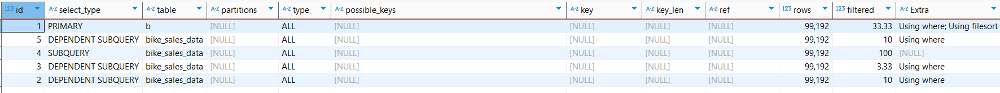

# Original query execution plan:
## EXPLAIN:

### It analyses 99 192 * (99 192 * 4) rows  without indexes
As we can see there are no indexes.\
Also, For each row it repeatedly takes 4 subqueries, so execution takes insanely long.
