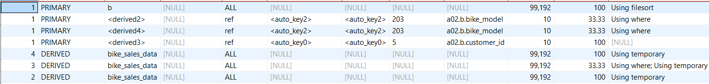

# Refactored query execution plan:
## EXPLAIN:

### It analyses 99 192 * 4 + 3 * 10 ≈ 400 000 without indexes
As we can see there are no indexes.\
It first making subqueries and then select from primary query.

## EXPLAIN ANALYZE:
-> Nested loop left join  (cost=4.58e+6 rows=0) (actual time=710..1017 rows=27149 loops=1) \
-> Nested loop inner join  (cost=1.62e+6 rows=1.19e+6) (actual time=587..838 rows=27149 loops=1) \
-> Nested loop inner join  (cost=370414 rows=343149) (actual time=373..546 rows=49999 loops=1) \
-> Sort: b.sale_date DESC, b.customer_id  (cost=10071 rows=99192) (actual time=158..177 rows=100000 loops=1) \
-> Table scan on b  (cost=10071 rows=99192) (actual time=0.612..55.2 rows=100000 loops=1) \
-> Filter: (b.price > abp.avg_price)  (cost=0.75..2.59 rows=3.46) (actual time=0.00338..0.00353 rows=0.5 loops=100000) \
-> Index lookup on abp using <auto_key2> (bike_model=b.bike_model)  (cost=0.25..2.59 rows=10.4) (actual time=0.00295..0.00317 rows=1 loops=100000) \
-> Materialize CTE avg_bike_price  (cost=0..0 rows=0) (actual time=215..215 rows=7 loops=1) \
-> Table scan on <temporary>  (actual time=215..215 rows=7 loops=1) \
-> Aggregate using temporary table  (actual time=215..215 rows=7 loops=1) \
-> Table scan on bike_sales_data  (cost=10071 rows=99192) (actual time=0.411..78.9 rows=100000 loops=1) \
-> Filter: (b.quantity > aq.average_quantity)  (cost=0.75..2.59 rows=3.46) (actual time=0.00548..0.00565 rows=0.543 loops=49999) \
-> Index lookup on aq using <auto_key2> (bike_model=b.bike_model)  (cost=0.25..2.59 rows=10.4) (actual time=0.00505..0.00528 rows=1 loops=49999) \
-> Materialize CTE avg_quantity  (cost=0..0 rows=0) (actual time=213..213 rows=7 loops=1) \
-> Table scan on <temporary>  (actual time=213..213 rows=7 loops=1) \
-> Aggregate using temporary table  (actual time=213..213 rows=7 loops=1) \
-> Table scan on bike_sales_data  (cost=10071 rows=99192) (actual time=0.164..74.9 rows=100000 loops=1) \
-> Index lookup on rp using <auto_key0> (customer_id=b.customer_id)  (cost=0.25..2.5 rows=10) (actual time=0.006..0.0063 rows=0.989 loops=27149) \
-> Materialize CTE recent_purchases  (cost=0..0 rows=0) (actual time=124..124 rows=8840 loops=1) \
-> Table scan on <temporary>  (actual time=110..112 rows=8840 loops=1) \
-> Aggregate using temporary table  (actual time=110..110 rows=8840 loops=1) \
-> Filter: (bike_sales_data.sale_date > DATE'2023-01-01')  (cost=10071 rows=33061) (actual time=3.31..83.2 rows=36553 loops=1) \
-> Table scan on bike_sales_data  (cost=10071 rows=99192) (actual time=3.3..67.5 rows=100000 loops=1) \

