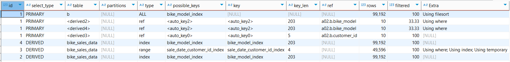

# Indexed query execution plan:
## EXPLAIN:

### It analyses 99 192 * 3 + 49 596 + 10 * 3 rows, but uses indexes
Indexing in the subqueries and main query help to optimize work while selecting data.\
Usage of bike_model_index and composite sale_date_customer_id_index.\
As we can see in explain analyse indexes are used here.

## EXPLAIN ANALYZE
-> Nested loop left join  (cost=4.59e+6 rows=0) (actual time=959..1512 rows=27149 loops=1) \
-> Nested loop inner join  (cost=1.62e+6 rows=1.19e+6) (actual time=893..1349 rows=27149 loops=1) \
-> Nested loop inner join  (cost=370414 rows=343149) (actual time=608..925 rows=49999 loops=1) \
-> Sort: b.sale_date DESC, b.customer_id  (cost=10071 rows=99192) (actual time=232..272 rows=100000 loops=1) \
-> Table scan on b  (cost=10071 rows=99192) (actual time=0.484..99.5 rows=100000 loops=1) \
-> Filter: (b.price > abp.avg_price)  (cost=14213..2.59 rows=3.46) (actual time=0.00599..0.00624 rows=0.5 loops=100000) \
-> Index lookup on abp using <auto_key2> (bike_model=b.bike_model)  (cost=19992..19994 rows=10.4) (actual time=0.00521..0.00558 rows=1 loops=100000) \
-> Materialize CTE avg_bike_price  (cost=19991..19991 rows=6) (actual time=376..376 rows=7 loops=1) \
-> Group aggregate: avg(bike_sales_data.price)  (cost=19991 rows=6) (actual time=50.2..376 rows=7 loops=1) \
-> Index scan on bike_sales_data using bike_model_index  (cost=10071 rows=99192) (actual time=2.3..312 rows=100000 loops=1) \
-> Filter: (b.quantity > aq.average_quantity)  (cost=14213..2.59 rows=3.46) (actual time=0.00787..0.00817 rows=0.543 loops=49999) \
-> Index lookup on aq using <auto_key2> (bike_model=b.bike_model)  (cost=19992..19994 rows=10.4) (actual time=0.0071..0.0075 rows=1 loops=49999) \
-> Materialize CTE avg_quantity  (cost=19991..19991 rows=6) (actual time=285..285 rows=7 loops=1) \
-> Group aggregate: avg(bike_sales_data.quantity)  (cost=19991 rows=6) (actual time=42.2..285 rows=7 loops=1) \
-> Index scan on bike_sales_data using bike_model_index  (cost=10071 rows=99192) (actual time=1.45..243 rows=100000 loops=1) \
-> Index lookup on rp using <auto_key0> (customer_id=b.customer_id)  (cost=0.25..2.5 rows=10) (actual time=0.00498..0.00547 rows=0.989 loops=27149) \
-> Materialize CTE recent_purchases  (cost=0..0 rows=0) (actual time=66.1..66.1 rows=8840 loops=1) \
-> Table scan on <temporary>  (actual time=52.9..54.4 rows=8840 loops=1) \
-> Aggregate using temporary table  (actual time=52.9..52.9 rows=8840 loops=1) \
-> Filter: (bike_sales_data.sale_date > DATE'2023-01-01')  (cost=10023 rows=49596) (actual time=1.53..27.9 rows=36553 loops=1) \
-> Covering index range scan on bike_sales_data using sale_date_customer_id_index over ('2023-01-01' < sale_date)  (cost=10023 rows=49596) (actual time=1.53..21.3 rows=36553 loops=1) \
